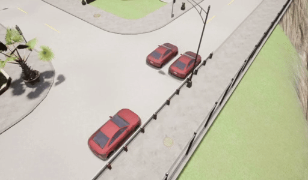

# S-Parking

S-Parking is a simulation project built using the Carla Simulator (version 0.9.15). It demonstrates a parking scenario where an ego vehicle, obstacles, and multiple sensors (LiDAR and collision sensors) are spawned and managed by a state machine-based parking controller.

> **Note:** This project has been developed and tested with Carla 0.9.15. Compatibility with other versions is not guaranteed.

*Demo: S-Parking simulation showcasing the ego vehicle performing parking maneuvers.*

## Table of Contents

- [Project Overview](#project-overview)
- [Modules Overview](#modules-overview)
- [Future Enhancements](#future-enhancements)
- [Known Limitations](#known-limitations)
- [License](#license)
- [Acknowledgments](#acknowledgments)

## Project Overview

S-Parking simulates a parking scenario in Carla by:

- **Spawning Actors:** An ego vehicle and obstacles are spawned using predefined transforms.
- **Sensor Integration:** Multiple LiDAR sensors and a collision sensor are attached to the ego vehicle.
- **State Machine Controller:** A parking controller processes sensor data and applies vehicle control commands to perform parking maneuvers.
- **Modular Design:** The code is organized into clearly defined modules to facilitate maintenance and future enhancements.

## Modules Overview

- **Configuration (`src/config.py`):**  
  Centralizes settings including connection parameters, spawn transforms, sensor parameters, and parking controller thresholds.

- **Scenario Management (`src/scenario.py`):**  
  The `SParkingScenario` class sets up the world, spawns the ego vehicle, obstacles, and sensors, and provides cleanup functionality.

- **Controller (`src/controller/`):**  
  Contains the `ParkingController` (state machine) and supporting modules (`vehicle_controller.py` and `parking_state.py`).  
  The controller processes sensor data and transitions through various parking phases.

- **Sensors (`src/sensors/`):**  
  - **Lidar Sensor (`src/sensors/lidar_sensor.py`):**  
    The `AdvancedLidarSensor` class processes LiDAR point clouds and provides distance query methods.
  - **Collision Sensor (`src/sensors/collision_sensor.py`):**  
    The `CollisionSensorManager` manages collision detection.

- **Utilities (`src/utils/`):**  
  - **Distance (`src/utils/distance.py`):**  
    Contains functions for distance calculations.
  - **Sensor Buffer (`src/utils/sensor_buffer.py`):**  
    Provides smoothing for sensor data using a buffer.

## Future Enhancements

- **Enhanced Sensor Usage:**  
  Improve the use of front and rear sensors to achieve a balanced distance measurement between the front and rear vehicles.
- **Sensor Fusion Techniques:**  
  Integrate sensor fusion methods to increase consistency and reliability in the sensor data.
- **Parking Space Detection:**  
  During parking maneuvers, automatically detect available parking spaces and adjust the vehicle's position to the correct distance.
- **Machine Learning Integration:**  
  Explore the use of machine learning (deep learning) techniques to enhance environmental perception and decision-making during the parking process.

## Known Limitations

- **Carla Version:**  
  This project was developed and tested using Carla Simulator 0.9.15. Compatibility with other versions is not guaranteed.
- **Simplistic State Machine:**  
  The parking controller is implemented as a basic state machine for demonstration purposes. More complex parking scenarios may require additional states or more refined control logic.

## License

This project is licensed under the MIT License - see the [LICENSE](LICENSE) file for details.

## Acknowledgments

This project was created by **David Cohen** and **Michele Monti**.